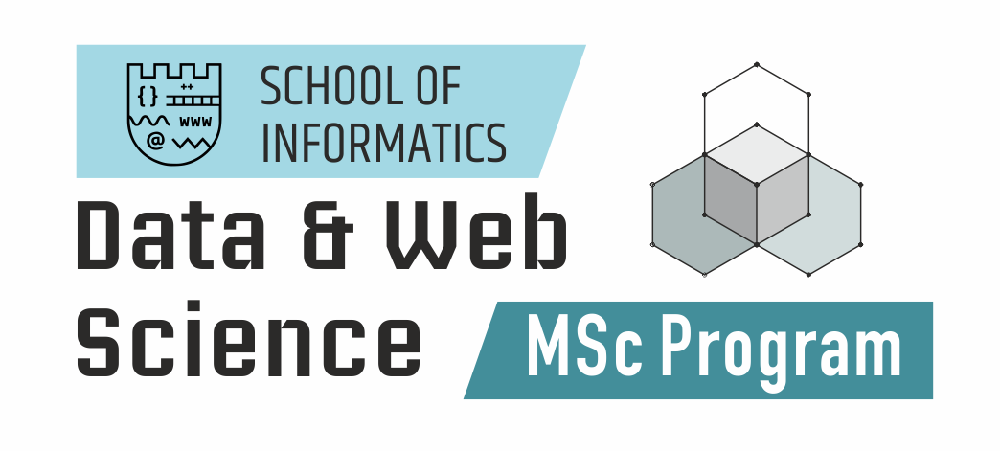

# Mining-of-Massive-Datasets-AUTh

Project A: “Big-Data Graph Analytics (or what?)”

## MSc Data and Web Science 2020-2021

## Team 8 - Members

* Panagiotis Papaemmanouil, 56
* Dimitris Tourgaidis, 66

---

## Course: Mining of Massive Datasets

**Assignment:** (Add description here)

[Assignment](./docs/project_pdf.pdf)

[Report](./docs/report_pdf.pdf)

---

## Technology Stack

### Python

**Python official website:** <https://www.python.org/>

### Spark

**Spark Documentation 3.0.1:** <https://spark.apache.org/docs/latest/index.html>

### PySpark

**PySpark Documentation:** <https://spark.apache.org/docs/latest/api/python/index.html>

---

## Datasets
